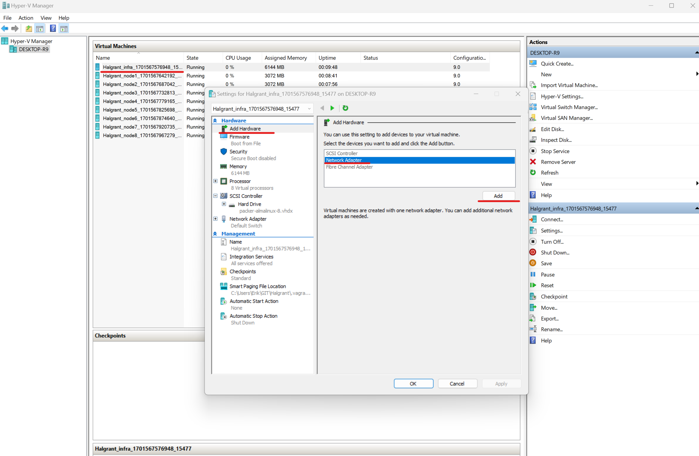
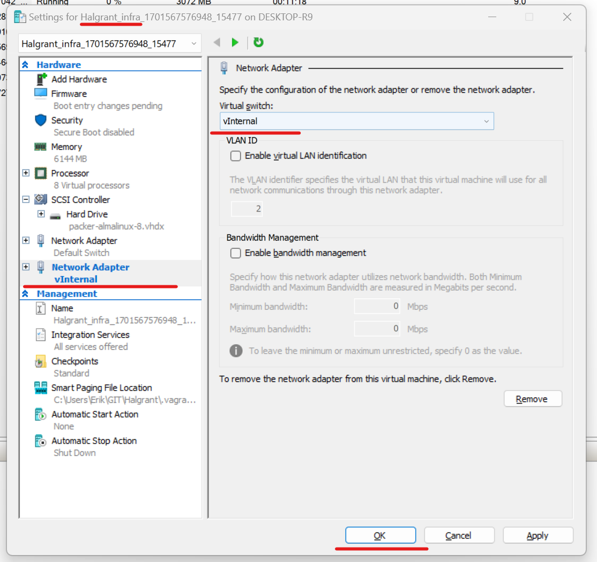

# Halgrant


## A Seamless Hyper-V, AlmaLinux, and Vagrant Integration for Efficient VM Creation


_Halgrant_ is a robust solution designed to streamline the process of virtual machine (VM) creation and management. This repository contains a Vagrantfile and supporting scripts that leverage the power of Vagrant, the versatility of AlmaLinux 8.8, and the efficiency of Hyper-V for a seamless VM setup. It's tailored for developers and system administrators who need a reliable, automated, and scalable environment for testing, development, or deployment purposes. Whether you're creating a single VM or orchestrating a cluster, _Halgrant_ offers a simplified yet powerful way to manage your virtual infrastructure.

Key Features:
- **Easy Configuration**: Set up your VMs with a simple, intuitive configuration process.
- **Cross-Platform Compatibility**: Utilizing AlmaLinux 8.8, enjoy a stable, secure, and open-source platform.
- **Hyper-V Integration**: Take advantage of Hyper-V for robust and efficient virtualization.
- **Automated Workflow**: Automate repetitive tasks in VM provisioning and management.
- **Scalability**: Effortlessly scale your VM setup as your project grows.

_Halgrant_ is ideal for those who seek a balanced blend of simplicity, power, and flexibility in their virtualization tasks. Dive into the world of efficient VM management with _Halgrant_!


## Powershell commands (run as administrator)

This command creates a new virtual switch named “vInternal” (used later in Vagrantfile) with the switch type set to Internal. An internal switch allows communication between the virtual machines on the host and the host operating system.
```
New-VMSwitch -Name "vInternal" -SwitchType Internal
```

This command gets the basic network adapter properties. By default, it only returns the visible adapters, but you can use the -IncludeHidden or -Physical parameters to include hidden or physical adapters. You can also filter the adapters by name, interface description, or interface index
```
Get-NetAdapter
```

When you're successful, you should see something like this:
```
Name                      InterfaceDescription                    ifIndex Status       MacAddress             LinkSpeed
----                      --------------------                    ------- ------       ----------             ---------
vEthernet (vInternal)     Hyper-V Virtual Ethernet Adapter #3          19 Up           -----------------        10 Gbps
Wi-Fi                     RZ608 Wi-Fi 6E 80MHz                         11 Up           -----------------     866.7 Mbps
Ethernet                  Realtek Gaming 2.5GbE Family Controller       4 Disconnected -----------------          0 bps
Bluetooth Network Conn... Bluetooth Device (Personal Area Netw...       2 Disconnected -----------------         3 Mbps
```

# Enable Hyper-V
This command enables the optional Windows feature named Microsoft-Hyper-V on the online (running) operating system. The -All parameter specifies that all parent features and subfeatures should also be enabled
```
Enable-WindowsOptionalFeature -Online -FeatureName Microsoft-Hyper-V -All
```

# Install Vagrant
Please, check the details described in official [Install Vagrant page](https://developer.hashicorp.com/vagrant/tutorials/getting-started/getting-started-install)

# Steps before deployment of Hyper-v VMs using Vagrant

## Some of the parameters below need to be adjusted to achieve functionality, and some of them can be adjusted according to your preferences
##### Define the number of worker nodes
```
WORKER_COUNT = 7
```
##### Define the network settings
```
NETWORK_PREFIX = "172.21"

NETWORK_MASK = "255.255.240.0"

NETWORK_GATEWAY = "172.21.112.1"

NETWORK_DNS = ["8.8.8.8", "8.8.4.4"]
```
##### Define the box name and version
```
BOX_NAME = "almalinux/8"

BOX_VERSION = "8.8.20230524"


# Available versions (03/Dec/2023): 8.3.20210203, 8.3.20210222, 8.3.20210330, 8.3.20210427, 8.4.20210527, 8.4.20210724, 8.4.20211014, 8.5.20211111, 8.5.20211118, 8.5.20211208, 8.5.20220316, 8.6.20220513, 8.6.20220715, 8.6.20220802, 8.6.20220819, 8.6.20220830, 8.6.20221001, 8.7.20221112, 8.7.20230228, 8.8.20230524, 8.8.20230606, 8.9.20231125

# Check the compatibility of 'Available versions' with hyperv provider
# https://app.vagrantup.com/almalinux/boxes/8
```
##### Define the memory settings for 'infra' host and 'worker' hosts
```
INFRA_MEMORY = 6144

WORKER_MEMORY = 3072
```
##### Define the number of CPUs for 'infra' host and 'worker' hosts
```
INFRA_CPU = 8

WORKER_CPU = 4
```
##### Define custom settings
```
CUSTOM_USER = "<ChangeMe!>"
CUSTOM_PASS = "<ChangeMe!>"
```
##### Define custom private and public keys
```
KEY_PRIV = "<ChangeMe!>"
KEY_PUB = "<ChangeMe!>"
```
# Run Vagrant
```vagrant up```
in case of issue related to provider:
```vagrant up --provider hyperv```


# Initial steps after deployment

As mentioned above, the infra VM has internet access via the public network and can communicate with the worker nodes via the private network called 'vInternal'.

## Add Network Adapter to your 'infra' node
<!-- 
https://github.com/bacikerik/vagrant_hyperV/blob/main/src/image/vInternal.png -->


## Set new adapter as vInternal to your 'infra' node
<!--  -->
